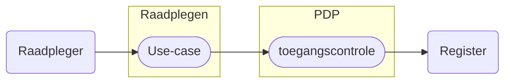

# Raadplegen Leveringsregister 

> [!IMPORTANT] - 06-02-2026
> Hieronder staan de eerste beschrijvingen van de basis raadplegingen op het Leveringsregister.
> 
> De raadplegingen volgen in de basis de [notificaties](/notificaties/README.md) omdat het uitgangspunt is dat de ontvanger van een notificatie op basis daarvan een raadpleging wil (kunnen) uitvoeren. 
> 
> Waar mogelijk is er een raadpleeg use-case en toegangscontrole beschrijving beschikbaar. Waar dat nog ontbreekt volgen ze zo snel mogelijk maar dat is afhankelijk of de raadpleging technisch mogelijk is rekeninghoudend met de vereiste toegangscontrole.

Het raadplegen van het Leveringsregister is gebonden aan voorwaarden. De raadpleger moet bevoegd zijn én het vastgestelde raadpleegpatroon volgen. Dit patroon is essentieel voor het valideren van de toestemming.

Als het patroon niet wordt gevolgd — bijvoorbeeld door ontbrekende autorisatie, onjuiste of incomplete input, of het opvragen van ongeoorloofde gegevens — wordt de toegang geweigerd of het resultaat beperkt.

Uses-cases beschrijven hoe een deelnemer het register correct raadpleegt. Per use-case zijn er toegangscontroles beschreven zodat de verbinding met de bijbehorende autorisatie en de benodigde policy gemaakt kan worden.

Meer informatie over de structuur van het raadplegen en het valideren ervan is te lezen in het [Afsprakenstelsel iWlz](https://wlz.atlassian.net/wiki/spaces/IWLZAS/pages/23071274/Raadplegen)

## Autorisatieregels en autorisatiematrix
De toegang tot gegevens is vastgelegd doormiddel van **Autorisatieregels** en de **Autorisatiematrix**. De [autorisatieregels](https://informatiemodel.istandaarden.nl/informatiemodel/iwlz/netwerk/leveringsregister-1/regels/autorisatieregel/) zijn te vinden in het Informatiemodel leveringsregister (via [hier](https://informatiemodel.istandaarden.nl/informatiemodel/iwlz/netwerk/leveringsregister-1/regels/autorisatieregel/)) en de [autorisatiematrix](/raadplegen/autorisatiematrix_leveringsregister.md) is [hier](/raadplegen/autorisatiematrix_leveringsregister.md) te vinden.

# Use cases raadplegen Leveringsregister

De use-cases voor het raadplegen van het Leveringsregister per rol en bijbehorende beschrijving van de toegangscontrole door de PDP[^1].

Kies een use-case voor de beschrijving van het raadplegen of controleren van de toegang van die raadpleging.

### Aanbieder
| Doel | toelichting | raadplegen | toegangscontrole |
| :--- | :--- | :--- | :--- |
| Compleet overzicht | **Als** aanbieder **wil ik** voor het leveren van zorg of ondersteuning gegevens over de status van de levering van de zorg of ondersteuning raadplegen die horen bij de (informatieve) toewijzingen (bemiddelingspecificaties) van andere aanbieders **zodat ik** het volledige inzicht heb in de leveringen en levering beter kan afstemmen. | *nog te bepalen - (0001)* | *nog te bepalen* |  
| VerzoekAanbieder en Verzoek | **Als** aanbieder die een notificatie over `VerzoekAanbieder` heeft ontvangen, **wil ik** VerzoekAanbieder, het bijbehorende Verzoek en de cliënt kunnen raadplegen, zodat ik op de hoogte ben van de aanvraag voor een toewijzing. | *nog te bepalen - (0002)* | *nog te bepalen* |  

### Zorgkantoor
| Doel | toelichting | raadplegen | toegangscontrole |
| :--- | :--- | :--- | :--- |
| Nieuwe of Gewijzigde Leveringperiode | Op basis van notificatie actuele status | 0006 | |
| Nieuwe of Gewijzigde Uitstelperiode | Op basis van notificatie actuele status | 0007 | |
| Nieuw of Gewijzigd Afstel | Op basis van notificatie de actuele status | 0008 | |
| Nieuws of Gewijzigd Verzoek | **Als** verantwoordelijk zorgkantoor **wil ik** het Verzoek en bijbehorende VerzoekAanbieders kunnen raadplegen **zodat ik** de client naar de juiste zorg kan toeleiden. | *nog te bepalen - (0004)*  | *nog te bepalen*  |
| Levering | **Als** zorgkantoor **wil ik** de status van de levering kunnen raadplegen horend bij een toewijzing (bemiddelingspecificaties), **zodat ik** inzicht heb in de leveringen door deze aanbieder aan de cliënt. | *nog te bepalen - (0003)*  | *nog te bepalen* |

---
Terug naar [HOME](/README.md)

[^1]: PDP: Policy Decision Point. [Afsprakenstelsel iWlz - Raadplegen](https://wlz.atlassian.net/wiki/spaces/IWLZAS/pages/23071274/Raadplegen)