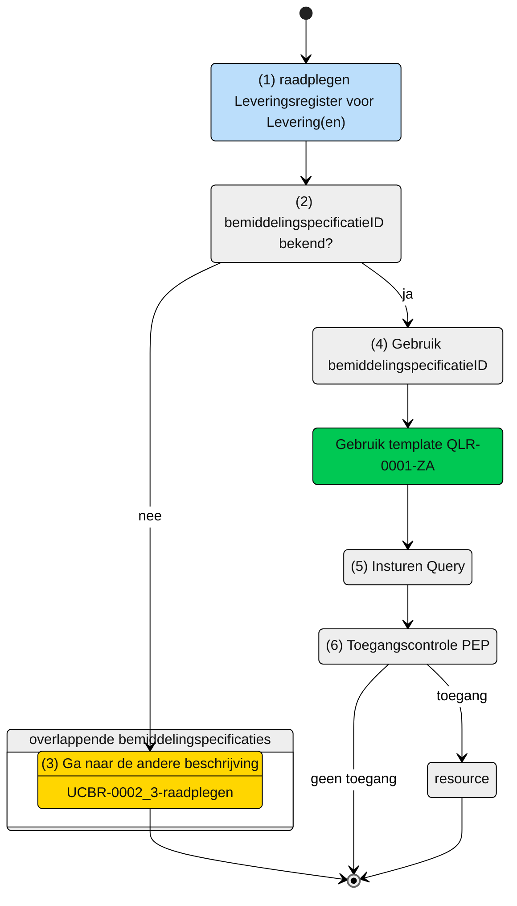

# Raadplegen van de Levering die horen bij overlappende Bemiddelingspecificatie(s) door de Aanbieder (UCLR-0001)

## Use Case Beschrijving

**Titel:** Raadplegen van de Levering die horen bij overlappende Bemiddelingspecificatie(s) door de Aanbieder 
**Actoren:** Aanbieder betrokken bij de levering van zorg en ondersteuning aan een cliënt

### Precondities:
- De Levering is opgenomen in het Leveringsregister
- De aanbieder is door het verantwoordelijk zorgkantoor betrokken bij de levering van zorg en ondersteuning aan de cliënt door de registratie van een bemiddelingspecificatie.

### Autorisatie
Een aanbieder mag voor het leveren van zorg en ondersteuning aan een cliënt de gegevens over de status van de levering van de zorg of ondersteuning raadplegen die horen bij overlappende bemiddelingspecificaties.
- Volledige autorisatieregel: [LRA005](https://informatiemodel.istandaarden.nl/informatiemodel/iwlz/netwerk/leveringsregister-1/regels/autorisatieregel/)
- Autorisatiematrix: [LRA0005]() 

**Trigger:**
- Een aanbieder wil de levering die horen bij de overlappende bemiddelingspecificaties raadplegen.

## Query-template beschrijving

| **Query ID** | **Beschrijving** | **Verplichte input** | **resultaat** |
|---|---|---|---|
| [QLR-0001-ZA]() | Op basis van de bemiddelingspecificatieID van de overlappende toewijzing en eigen identificatie, de Levering, Leveringperiode, Behandelperiode, Uitstelperiode, Afstel en Client raadplegen |  `bemiddelingspecificatieID` | Levering / Leveringperiode / Behandelingperiode / Uitstelperiode / Afstel / Client | 

## **Proces raadplegen**

Een aanbieder is bij de zorg van een cliënt betrokken door het zorgkantoor. Op basis van de overlappende bemiddelingspecificaties mag de aanbieder de Leveringen van deze overlappende bemiddelingspecificaties raadplegen. 

### Schematisch:

| # | Toelichting |
| ---: | :--- |
| 1. | *start* raadplegen. |
| 2. | Is **`bemiddelingspecificatieID`** bekend?  - **Ja** -> ga verder naar stap 4.   - **Nee** -> Ga naar stap 3. |
| 3. | Gebruik eerst query-template `QBR-0002_3` (zie beschrijving [UCBR-0002_3-raadplegen](https://github.com/iStandaarden/iWlz-bemiddeling/blob/Bemiddelingsregister-1/raadplegen/zorgaanbieder/UCBR-0002_3-raadplegen.md)). |
| 4. | Gebruik query-template [QLR-0001-ZA](https://github.com/iStandaarden/iWlz-levering/blob/leveringsregister-1/raadplegen/aanbieder/UCLR-0001-raadplegen.md) en vul verplichte parameter:   - `bemiddelingspecificatie`.|
| 5. | De **aanbieder** stuurt Graphql-request + Acces-token naar het Policy Enforcement Point (PEP). |
| 6. | De PEP voert de [toegangscontrole](https://github.com/iStandaarden/iWlz-levering/blob/Leveringsregister-1/raadplegen/aanbieder/UCLR-0001-toegangscontrole.md) uit en stuurt bij toegang het request door naar het leveringsregister. |
| 7. | De aanbieder ontvangt response van de PEP (bij ongeldig verzoek) of vanuit het Leveringsregister (resource). |
| 8. | *Einde proces* | 

---

Ga naar beschrijving van de bijbehorende [toegangscontrole](https://github.com/iStandaarden/iWlz-levering/blob/Leveringsregister-1/raadplegen/aanbieder/UCLR-0001-toegangscontrole.md) | Terug naar [Raadplegen](https://github.com/iStandaarden/iWlz-levering/blob/Leveringsregister-1/raadplegen/README.md)
