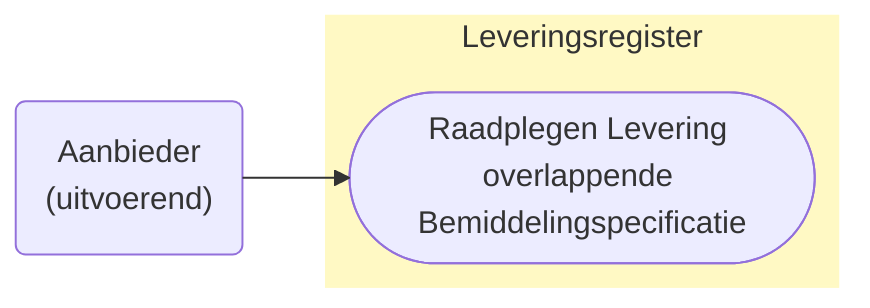
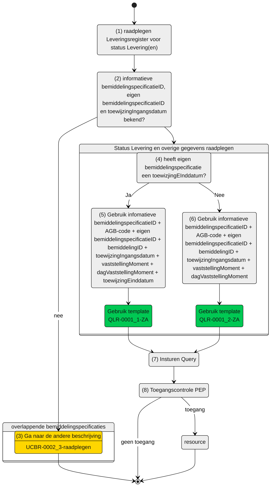

# Raadplegen van de Levering die horen bij overlappende Bemiddelingspecificatie(s) door de Aanbieder (UCLR-0001)

> [!CAUTION] 
> Voor de controle op de toegang van deze query is er een PIP controle nodig. De toets of dit mogelijk met de huidige informatie mogelijk is, is moet nog plaatsvinden. De query kan nog wijzigen, wat effect kan hebben op het schema. 

## Use Case Beschrijving

**Titel:** Raadplegen van de Levering die horen bij overlappende Bemiddelingspecificatie(s) door de Aanbieder 
**Actoren:** Aanbieder betrokken bij de levering van zorg en ondersteuning aan een cliënt

### Precondities:
- De Levering is opgenomen in het Leveringsregister
- De aanbieder is door het verantwoordelijk zorgkantoor betrokken bij de levering van zorg en ondersteuning aan de cliënt door de registratie van een bemiddelingspecificatie.

### Autorisatie
Een aanbieder mag voor het leveren van zorg en ondersteuning aan een cliënt de gegevens over de status van de levering van de zorg of ondersteuning raadplegen die horen bij overlappende bemiddelingspecificaties.
- Volledige autorisatieregel: [LRA005](https://informatiemodel.istandaarden.nl/informatiemodel/iwlz/netwerk/leveringsregister-1/regels/autorisatieregel/)
- Autorisatiematrix: [LRA0005](@@@) 

**Trigger:**
- Een aanbieder wil voor het leveren van zorg of ondersteuning aan een cliënt de levering die horen bij de overlappende bemiddelingspecificaties raadplegen.

## Query-template beschrijving

| **Query ID** | **Beschrijving** | **Verplichte input** | **resultaat** |
|---|---|---|---|
| [QLR-0001_1-ZA](/gql-query/aanbieder/QLR-0001-ZA.graphql) |Op basis van de bemiddelingspecificatieID van de informatieve toewijzing, de eigen bemiddelingspecificatieID, eigen identificatie, toewijzingingangsdatum, vaststellingMoment, en toewijzingEinddatum de Levering (en overige toegestane informatie) raadplegen, die hoort bij de informatieve toewijzing. |  `bemiddelingspecificatieIDEigen`, `bemiddelingspecificatieIDInformatieve`, `instelling`, `toewijzingIngangsdatum`, `vaststellingMoment`, `dagVaststellingMoment`, `toewijzingEinddatum`, `bemiddelingID` | Levering / Leveringperiode / Behandelingperiode / Uitstelperiode / Afstel / Client | 
| [QLR-0001_2](@@@) | Op basis van de bemiddelingspecificatieID van de informatieve toewijzing, de eigen bemiddelingspecificatieID, eigen identificatie, toewijzingingangsdatum en vaststellingMoment, de Levering (en overige toegestane informatie) raadplegen, die hoort bij de informatieve toewijzing. | `bemiddelingspecificatieIDEigen`, `bemiddelingspecificatieIDInformatieve`, `instelling`, `toewijzingIngangsdatum`, `vaststellingMoment`, `dagVaststellingMoment`, `toewijzingEinddatum`, `bemiddelingID` | Levering / Leveringperiode / Behandelingperiode / Uitstelperiode / Afstel / Client |

## **Proces raadplegen**

Een aanbieder is bij de zorg van een cliënt betrokken door het zorgkantoor. Met aanvullende informatie uit de overlappende bemiddelingspecificatie en de aanvullende informatie van de eigen bemiddelingspecificatie (zie ook [UCBR-0002_3](https://github.com/iStandaarden/iWlz-bemiddeling/blob/Bemiddelingsregister-1/raadplegen/zorgaanbieder/UCBR-0002_3-raadplegen.md)) kan de aanbieder de status van de levering zien die horen bij de informatieve toewijzing (bemiddelingspecificatie). 
Hiervoor zijn naast de informatieve `bemiddelingspecificatieID` ook de eigen `bemiddelingspecificatieID` en de eigen `agb-code` nodig. Tevens is van de eigen bemiddelingspecificatie ook de`bemiddelingID`, `toewijzingsIngangsdatum`, het `vaststellingMoment` en de `toewijzingEinddatum` nodig. De toewijzingEinddatum is allen nodig zodra de eigen bemiddelingspecificatie een toewijzingEinddatum heeft.

### Schematisch:

| # | Toelichting |
| ---: | :--- |
| 1. | Start raadplegen Leveringsregister. |
| 2. | Zijn de informatieve- en eigen `bemiddelingspecificatieID` en `toewijzingIngangsdatum` bekend?  - **Ja** -> ga verder naar stap 4.   - **Nee** -> Ga naar stap 3. |
| 3. | Gebruik eerst query-template `QBR-0002_3-ZA` (zie beschrijving [UCBR-0002_3-raadplegen](https://github.com/iStandaarden/iWlz-bemiddeling/blob/Bemiddelingsregister-1/raadplegen/zorgaanbieder/UCBR-0002_3-raadplegen.md)). |
| 4. | Heeft de eigen `bemiddelingspecificatie` (inmiddels) een`toewijzingEinddatum`?   - **Ja** -> ga verder naar stap 5   - **Nee** -> Ga verder naar stap 6 |
| 5. | Gebruik query-template `QLR-0001_1-ZA` en vul de verplichte parameters:   - `bemiddelingspecificatieIDEigen`;   - `bemiddelingspecificatieIDInformatieve`;   - `uitvoerendZorgkantoor`;   - `toewijzingIngangsdatum`;   - `vaststellingMoment`;  - `dagVaststellingMoment`;   - `toewijzingEinddatum`. |
| 6. | Gebruik query-template `QLR-0001_2-ZA` en vul de verplichte parameters:    - `bemiddelingspecificatieIDEigen`;   - `bemiddelingspecificatieIDInformatieve`;   - `uitvoerendZorgkantoor`;   - `toewijzingIngangsdatum`;   - `vaststellingMoment`;   - `dagVaststellingMoment`.
| 7. | De **aanbieder** stuurt Graphql-request + Acces-token naar het Policy Enforcement Point (PEP). |
| 8. | De PEP voert de [toegangscontrole](/raadplegen/aanbieder/UCLR-0001-toegangscontrole.md) uit en stuurt bij toegang het request door naar het leveringsregister. |
| 9. | De aanbieder ontvangt response van de PEP (bij ongeldig verzoek) of vanuit het Leveringsregister (resource). |
| 10. | *Einde proces* | 

---

Ga naar beschrijving van de bijbehorende [toegangscontrole](/raadplegen/aanbieder/UCLR-0001-toegangscontrole.md) | Terug naar [Raadplegen](/raadplegen/README.md)
