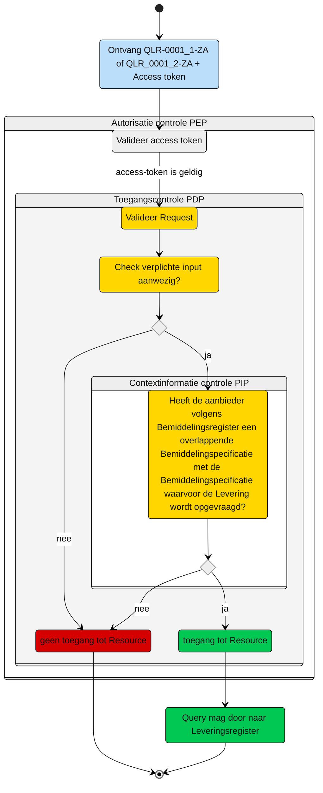

# Toegangscontrole: Raadplegen van de Levering die horen bij overlappende Bemiddelingspecificatie(s) door de Aanbieder (UCLR-0001)

> [!Caution]
> Voor de controle op toegang van deze query is er een PIP controle nodig. De toets of dit met de huidige informatie mogelijk is, moet nog plaatsvinden. De query kan nog wijzigen, wat effect kan hebben op het schema.


Beschrijving van de **toegangscontrole** door de Policy Decision Point (PDP) en indien van toepassing Policy Information Point (PIP).

N.b. Het valideren van de Acces-token door de PEP is geen onderdeel van deze beschrijving. Zie daarvoor het [Afsprakenstelsel iWlz - nID netwerkstelsel - 5. policy Enforcement Point](https://wlz.atlassian.net/wiki/spaces/IWLZAS/pages/229441537/nID+netwerkstelsel#5.-Policy-Enforcement-Point-(PEP)).

## Toegangscontrole PDP

### Subject
- **Entiteit:** Aanbieder
- **Kenmerk:** In bezit van een acces-token met daarin de eigen `agbcode`.

### Action
- **Type:** `raadplegen` (read)
- **Omschrijving:** Uitvoeren van GraphQL-query [QLR-0001_1-ZA](/gql-query/aanbieder/QLR-0001-ZA.graphql) Of [QLR-0001_2-ZA](/iWlz-levering/gql-query/aanbieder/QLR-0001_2_ZA.graphql) op het Leveringsregister door een aanbieder. 

### Resource
- **Type:** `Leveringsregister`
- **ID:** `bemiddelingspecificatieID` van de informatieve bemiddelingspecificatie
- **Beperking:** Toegang tot de gegevens over de Levering van de informatieve toewijzing, indien deze toewijzing periode-overlap heeft met de eigen bemiddelingspecificatie. 
- **Inhoud:** De nodes Levering en de gerelateerde Leveringperiode, Behandelingperiode, Uitstelperiode, Afstel en Client mogen worden opgevraagd.

### Context
- **Query-parameters vereist:** <br>

| QLR-0001_1-ZA | QLR-0001_2-ZA |
| :--- | :--- |
| - informatieve `bemiddelingspecificatieID` | - informatieve `bemiddelingspecificatieID` |
| - eigen `bemiddelingspecificatieID` | - eigen `bemiddelingspecificatieID` |
| - `bemiddelingID` | - `bemiddelingID` |  
| - `instelling` | - `instelling` |
| - `vaststellingMoment` | - `vaststellingMoment`|
| - `dagVaststellingMoment` | - `dagVaststellingMoment` |
| - `toewijzingEindatum` |  |

- **Toegangsvoorwaarde:** Er is alleen toegang als aan alle volgende voorwaarde is voldaan:
    - De parameters zoals hierboven aanwezig zijn; 
    - De acces-token bevat een geldige `agbcode` van de aanbieder
    - De `agbcode` van de in de query meegegeven `instelling` komt overeen met de `agbcode`in de acces-token;
    - In het **Bemiddelingregister** bestaat er een `Bemiddelingspecificatie` waarbij: <ol><li>
        de `instelling` overeenkomt met de `agbcode` uit de acces-token **én**;<li>
        deze `bemiddelingspecificatie` hoort bij dezelfde `Bemiddeling` als waar de `bemiddelingspecificatie` waarvoor de `Levering` opgevraagd wordt ook bij hoort **én**;<li>
        deze bemiddelingspeciifcaties overlappen in periode met elkaar **én**;<li>
        de `toewijzingEinddatum` is leeg of de `toewijzingEinddatum` + 31 mei is groter dan of gelijk aan het opvraagmoment.</ol>  
    

 ### Resultaat
 > Toegang tot het Leveringsregister via query [QLR-0001_1-ZA](/iWlz-levering/gql-query/aanbieder/QLR-0001_1-ZA.graphql) of [QLR-0001_2-ZA](/iWlz-levering/gql-query/aanbieder/QLR-0001_2_ZA.graphql) is **alleen toegestaan** als:
 >- De relevante parameters aanwezig zijn in de query;
 >- De acces-token bevat een geldige `agbcode`;
 >- De in de query meegegeven `agbcode` in `instelling` komt overeen met de `agbcode` in de acces-token;
 >- In het Bemiddelingsregister is een match gevonden tussen:
 >      - De `agbcode` (uit de acces-token) én;
 >      - En een `bemiddelingspecificatie` die hoort bij een `Bemiddeling` als de `bemiddelingspecificatie` waarvoor de Levering opgevraagd is én; 
 >      - de `toewizjingEinddatum` is leeg of de `toewizingEinddatum` + 31 mei is groter dan of gelijk aan het opvraagmoment én;
 >      - de bemiddelingspecificaties overlappen.
 >
 > Indien aan deze voorwaarden is voldaan, mogen alle graphQl-nodes worden opgevraagd confrom de structuur van de query-template. 


## Toegangscontrole-flows Aanbieder: QLR-0001-ZA
Beschrijving van het autorisatieproces door de PEP.

### Schematisch:



| # | Toelichting |
| --: | :-- |
| 1. |Ontvangst GraphQL-request + access-token door **PEP** |
| 2. |De **PEP** valideert de access-token en geeft na goedkeur het request door aan de PDP |
| 3. |De **PDP** controleert op:<ol><li>Of het request voldoet aan de template en er geen ongeoorloofde gegevens worden opgevraagd.<li> Aanwezigheid van de verplichte parameters in het request;</ol>Is aan alle voorwaarden voldaan?<br/> - **Ja** →  Controle context-informatie door **PIP**: stap 4<br/>- **Nee** → geen toegang tot de resource - *Einde proces (geen toegang.)* |  
| 4. | De **PIP** controleert in het `Bemiddelingsregister` op de aanwezigheid van een `Bemiddelingspecificatie` waarbij:<br/><ol><li>De `aanbieder` overeenkomt met de `agbcode` uit de access-token, **én** <li>Deze `Bemiddelingspecificatie` behoort tot een `Bemiddeling` waarook de `bemiddelingspecificatie` waarvoor de Levering opgevraagd is bij hoort **én** <li> De `bemiddelingspecificatie` een `toewijzingEinddatum` heeft die leeg is óf de `toewijzingEinddatum`+ 31 mei is groter dan of gelijk aan het opvraagmoment **én**<li> Er overlap is tussen de beide `bemiddelingspecificaties`.</ol><br> Is aan de voorwaarde voldaan: <br> - **Ja** →  Toegang tot de resource: stap 5<br/>- **Nee** → geen toegang tot de resource - *Einde proces (geen toegang.)*  |
| 5. | De aanbieder krijgt toegang tot de `Levering`, met bijbehorende `Leveringperiode`, `Behandelingperiode`, `Uitstelperiode` en `Afstel`.
| 6. | *Einde*

## Toegangscontrole PIP:
Voor QLR-0001_1-ZA

```gql
query Bemiddelingspecificatie(
    $bemiddelingspecificatieIDEigen: UUID! # afkomstig uit query
    $instelling: String! # afkomstig uit acces-token
    $toewijzingIngangsdatum: Date! # afkomstig uit query
    $vaststellingMoment: DateTime! # afkomstig uit query
    $dagVaststellingMoment: Date! # afkomstig uit query
    $toewijzingEinddatum: Date! # afkomstig uit query
    $bemiddelingID: UUID! # afkomstig uit query
  ) {
    bemiddelingspecificatie(
        where: {
            bemiddelingspecificatieID: {eq: $bemiddelingspecificatieIDEigen}
            instelling: {eq: $instelling}
            toewijzingIngangsdatum: {eq: $toewijzingIngangsdatum}
            vaststellingMoment: {eq: $vaststellingMoment}
            toewijzingEinddatum: {eq: $toewijzingEinddatum}
            and: [ {
                bemiddeling: {
                    and: {
                        bemiddelingID: {eq: $bemiddelingID}
                    }
                }
            }]
         }
    ) {
        bemiddelingspecificatieID
        bemiddeling{
            bemiddelingID
            bemiddelingspecificatie(
                where: {
                    and: [
                    {
                       or: [{ toewijzingEinddatum: { eq: null } }, 
                       { toewijzingEinddatum: { gte: $toewijzingIngangsdatum } },
                       { toewijzingEinddatum: { gte: $dagVaststellingMoment } }]
                    }
                    { toewijzingIngangsdatum: { ngt: $toewijzingEinddatum } }
                ]
            }
        ){
                bemiddelingspecificatieID
        }
    }
   }
  }
  ```

Voor QLR-0001_2-ZA
```gql

 query Bemiddelingspecificatie(
     $bemiddelingspecificatieIDEigen: UUID! # afkomstig uit query
    $instelling: String! # afkomstig uit acces-token
    $toewijzingIngangsdatum: Date! # afkomstig uit query
    $vaststellingMoment: DateTime! # afkomstig uit query
    $dagVaststellingMoment: Date! # afkomstig uit query
    $bemiddelingID: UUID! # afkomstig uit query
  ) {
    bemiddelingspecificatie(
        where: {
            bemiddelingspecificatieID: {eq: $bemiddelingspecificatieIDEigen}
            instelling: {eq: $instelling}
            toewijzingIngangsdatum: {eq: $toewijzingIngangsdatum}
            vaststellingMoment: {eq: $vaststellingMoment}
            toewijzingEinddatum: {eq: null}
            and: [ {
                bemiddeling: {
                    and: {
                        bemiddelingID: {eq: $bemiddelingID}
                    }
                }
            }]
         }
    ) {
        bemiddelingspecificatieID
        bemiddeling{
            bemiddelingID
            bemiddelingspecificatie(
                where: {
                    and: [
                    {
                       or: [{ toewijzingEinddatum: { eq: null } }, 
                       { toewijzingEinddatum: { gte: $toewijzingIngangsdatum } },
                       { toewijzingEinddatum: { gte: $dagVaststellingMoment } }]
                    }
                ]
            }
        ){
                bemiddelingspecificatieID
        }
    }
   }
  }
```
----

Ga naar [UC beschrijving raadplegen](/raadplegen/aanbieder/UCLR-0001-raadplegen.md) -- Terug naar [Raadplegen](/raadplegen/README.md)