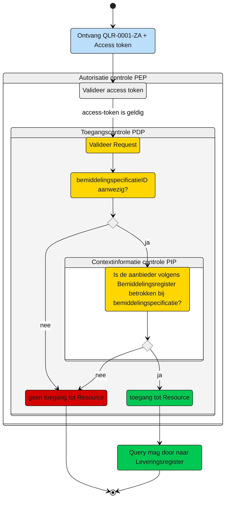

# Toegangscontrole: Raadplegen van de Levering die horen bij overlappende Bemiddelingspecificatie(s) door de Aanbieder (UCLR-0001)

Beschrijving van de **toegangscontrole** door de Policy Decision Point (PDP) en indien van toepassing Policy Information Point (PIP).

N.b. Het valideren van de Acces-token door de PEP is geen onderdeel van deze beschrijving. Zie daarvoor het [Afsprakenstelsel iWlz - nID netwerkstelsel - 5. policy Enforcement Point](https://wlz.atlassian.net/wiki/spaces/IWLZAS/pages/229441537/nID+netwerkstelsel#5.-Policy-Enforcement-Point-(PEP)).

## Toegangscontrole PDP

### Subject
- **Entiteit:** Aanbieder
- **Kenmerk:** In bezit van een acces-token met daarin de eigen `agbcode`.

### Action
- **Type:** `raadplegen` (read)
- **Omschrijving:** Uitvoeren van GraphQL-query [QLR-0001-ZA.graphql](/gql-query/aanbieder/QLR-0001-ZA.graphql) op het Leveringsregister door een aanbieder. 

### Resource
- **Type:** `Leveringsregister`
- **ID:** `bemiddelingspecificatieID`
- **Beperking:** Alleen toegang tot gegevens die horen bij een bemiddelingspecificatie die overlap heeft met de eigen bemiddelingspecificatie van de aanbieder.
- **Inhoud:** De nodes Levering en de gerelateerde Leveringperiode, Behandelperiode, Uitstelperiode, Afstel en Client mogen worden opgevraagd.

### Context
- **Query-parameters vereist:** De `bemiddelingspecificatieID` moet aanwezig zijn in de query.
- **Toegangsvoorwaarde:** Er is alleen toegang als aan alle volgende voorwaarde is voldaan:
    - De parameter `bemiddelingspecificatieID` is meegegeven in de query
    - De acces-token bevat een geldige `agbcode`
    - De `agbcode`in de acces-token komt overeen met de `agbcode` in `instelling` in `Bemiddelingspecificatie` die hoort bij dezelfde `Bemiddeling` als het `bemiddelingspecificatieID` aanwezig in de query 
    - Toegang geldt tot en met einddatumToewijzing + 31 mei van de eigen bemiddelingspecificatie die hoort bij dezelfde Bemiddeling als het `bemiddelingspecificatieID` aanwezig in de query  

 ### Resultaat
 > Toegang tot het Leveringsregister via query [QLR-0001-ZA](/gql-query/aanbieder/QLR-0001-ZA.graphql) is **alleen toegestaan** als:
 >- Parameter `bemiddelingspecificatieID` is meegegeven in de query
 >- In het Bemiddelingsregister is een match gevonden tussen:
 >      - De `agbcode` (uit de acces-token)
 >      - En een `bemiddelingspecificatie` die hoort bij een `Bemiddeling` waar ook het `bemiddelingspecificatieID` uit de query bijhoort 
 >- En toegang geldt tot de einddatumToewijzing + 31 mei van deze bemiddelingspecificatie 
>
> Als aan deze voorwaarden is voldaan, mogen de volgende gegevens worden opgevraagd:
>- De `Levering`, met bijbehorende `Leveringperiode`, `Behandelperiode`, `Uitstelperiode` en `Afstel`.


## Toegangscontrole-flows Aanbieder: QLR-0001-ZA
Beschrijving van het autorisatieproces door de PEP.

### Schematisch:



| # | Toelichting |
| --: | :-- |
| 1. |Ontvangst GraphQL-request + access-token door **PEP** |
| 2. |De **PEP** valideert de access-token en geeft na goedkeur het request door aan de PDP |
| 3. |De **PDP** controleert op:<ol><li>Of het request voldoet aan de template en er geen ongeoorloofde gegevens worden opgevraagd.<li> Aanwezigheid van de verplichte parameters in het request;</ol>Is aan alle voorwaarden voldaan?<br/> - **Ja** →  Controle context-informatie door **PIP**: stap 4<br/>- **Nee** → geen toegang tot de resource - *Einde proces (geen toegang.)* |  
| 4. | De **PIP** controleert in het `Bemiddelingsregister` op de aanwezigheid van een `Bemiddelingspecificatie` waarbij:<br/><ol><li>De `aanbieder` overeenkomt met de `agbcode` uit de access-token, **én** <li>Deze `Bemiddelingspecificatie` behoort tot een `Bemiddeling` waarvoor de `bemiddelingspecificatieID` overeenkomt met de opgevraagde waarde.</ol> Is aan de voorwaarde voldaan?<br/> - **Ja** →  Toegang tot de resource: stap 5<br/>- **Nee** → geen toegang tot de resource - *Einde proces (geen toegang.)*  |
| 5. | De aanbieder krijgt toegang tot de `Levering`, met bijbehorende `Leveringperiode`, `Behandelperiode`, `Uitstelperiode` en `Afstel`.
| 6. | *Einde*

## Toegangscontrole PIP:
```gql
Moet nog gedaan worden
```
----

Ga naar [UC beschrijving raadplegen](/raadplegen/aanbieder/UCLR-0001-raadplegen.md) -- Terug naar [Raadplegen](/raadplegen/README.md)