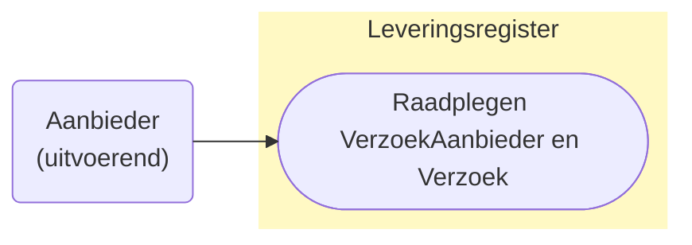

# Raadplegen van VerzoekAanbieder en Verzoek door de Aanbieder (UCLR-0002-ZA)

## Use Case beschrijving

**Titel:** Raadplegen van VerzoekAanbieder en Verzoek door de Aanbieder 
**Actoren:** Aanbieder vernoemd in VerzoekAanbieder

### Precondities:
- 
