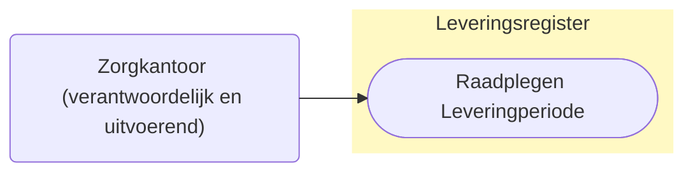

# Raadplegen van Leveringperiode door Zorgkantoor (UCLR-0003-ZKu)

## Use Case beschrijving

**Titel:** Raadplegen van Leveringperiode door het zorgkantoor 
**Actoren:** Zorgkantoor dat verantwoordelijk is voor de bemiddelingspecificatie of het zorgkantoor dat betrokken is bij de uitvoering van de zorg of ondersteuning.

### Precondities:
- Leveringperiode is opgenomen in het Leveringsregister.
- Het zorgkantoor is of het verantwoordelijk zorgkantoor voor de bemiddelingspecificatie of het zorgkantoor is betrokken door het verantwoordelijk zorgkantoor bij de levering van zorg of ondersteuning (uitvoerend zorgkantoor).

### Autorisaties:
Het (verantwoordelijk en uitvoerend) zorgkantoor mag de Leveringperiode raadplegen.
- Volledige autorisatieregel: [LRA0001](https://informatiemodel.istandaarden.nl/informatiemodel/iwlz/netwerk/leveringsregister-1/regels/autorisatieregel/lra0001/) / [LRA0002](https://informatiemodel.istandaarden.nl/informatiemodel/iwlz/netwerk/leveringsregister-1/regels/autorisatieregel/lra0002/)
- Autorisatiematrix: [LRA0001](@@@) / [LRA0002](@@@)

### Trigger:
Een zorgkantoor wil de Leveringperiode raadplegen die hoort bij een bemiddelingspecificatie waarvoor het zorgkantoor verantwoordelijk is of waarvoor het zorgkantoor betrokken is bij de levering.

## Query-template beschrijving
|**Query ID** | **Beschrijving** | **Verplichte input** | **Resultaat**|
| --- | :--- | :--- | :--- |
QLR-0003-ZKu | Op basis van de (ontvangen) leveringperiodeID en de eigen identificatie de Leveringperiode, Levering, Client en onderliggende entiteiten raadplegen | `leveringperiodeID`| Leveringperiode / Behandelingperiode / Levering / CLient/ Uitstelperiode / Afstel | 

