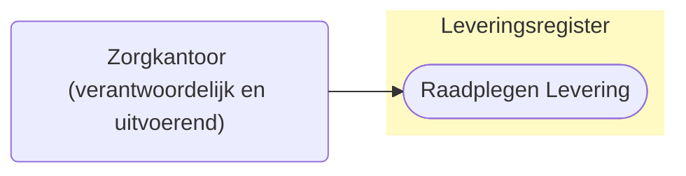
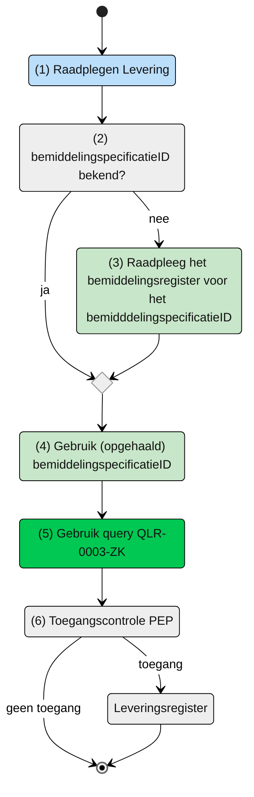

# Raadplegen van Levering door Zorgkantoor (UCLR-0003-ZK)

## Use Case beschrijving

**Titel:** Raadplegen van Levering door het zorgkantoor 
**Actoren:** Zorgkantoor dat verantwoordelijk is voor de bemiddelingspecificatie of het zorgkantoor dat betrokken is bij de uitvoering van de zorg of ondersteuning.

### Precondities:
- Levering is opgenomen in het Leveringsregister.
- Het zorgkantoor is of het verantwoordelijk zorgkantoor voor de bemiddelingspecificatie of het zorgkantoor is betrokken door het verantwoordelijk zorgkantoor bij de levering van zorg of ondersteuning (uitvoerend zorgkantoor).

### Autorisaties:
Het (verantwoordelijk en uitvoerend) zorgkantoor mag de Levering raadplegen.
- Volledige autorisatieregel: [LRA0001](https://informatiemodel.istandaarden.nl/informatiemodel/iwlz/netwerk/leveringsregister-1/regels/autorisatieregel/lra0001/) / [LRA0002](https://informatiemodel.istandaarden.nl/informatiemodel/iwlz/netwerk/leveringsregister-1/regels/autorisatieregel/lra0002/)
- Autorisatiematrix: [LRA0001](@@@) / [LRA0002](@@@)

### Trigger:
Een zorgkantoor wil de Levering raadplegen die hoort bij een bemiddelingspecificatie waarvoor het zorgkantoor verantwoordelijk is of waarvoor het zorgkantoor betrokken is bij de levering.

## Query-template beschrijving
|**Query ID** | **Beschrijving** | **Verplichte input** | **Resultaat**|
| --- | :--- | :--- | :--- |
QLR-0003-ZK | Op basis van de bemiddelingspecificatieID, Levering, Client en onderliggende entiteiten raadplegen | `bemiddelingspecificatieID`| Levering / Client / Leveringperiode / Behandelingperiode / Uitstelperiode / Afstel | 

## Proces raadplegen
Het zorgkantoor is of verantwoordelijk voor de bemiddelingspecificatie of is door het verantwoordelijk zorgkantoor betrokken bij de levering. Op basis van de bemiddelingspecificatie mag het zorgkantoor de leveringen die horen bij deze bemiddelingspecificatie raadplegen. 

**Schematisch:**

| **#** | **Toelichting** |
| --- | :--- |
| 1. | *Start* |
| 2. | Is het `bemiddelingspecificatieID` bekend?   - **Ja** -> Ga verder naar stap 4   - **Nee** -> Raadpleeg Bemiddelingsregister 
| 4. | Het zorgkantoor vult de verplichte `bemiddelingspecificatieID' in query-template [QLR-0003-ZK](@@@) en initieert een raadpleging van de Levering in het Leveringsregister. |
| 4. | Het zorgkantoor stuurt Graphql-request + Acces-token naar het Policy Enforcement Point (PEP) |
| 5. | De PEP voert de [toegangscontrole](@@@) uit en stuurt bij toegang het request door naar het leveringsregister.
| 6. | De aanbieder ontvangt response van de PEP (bij ongeldig verzoek) of vanuit het Leveringsregister (resource). |
| 7. | *Einde proces* | 

---
Ga naar beschrijving van de bijbehorende [toegangscontrole](@@@) | Terug naar [Raadplegen](https://github.com/iStandaarden/iWlz-levering/blob/Leveringsregister-1/raadplegen/README.md)