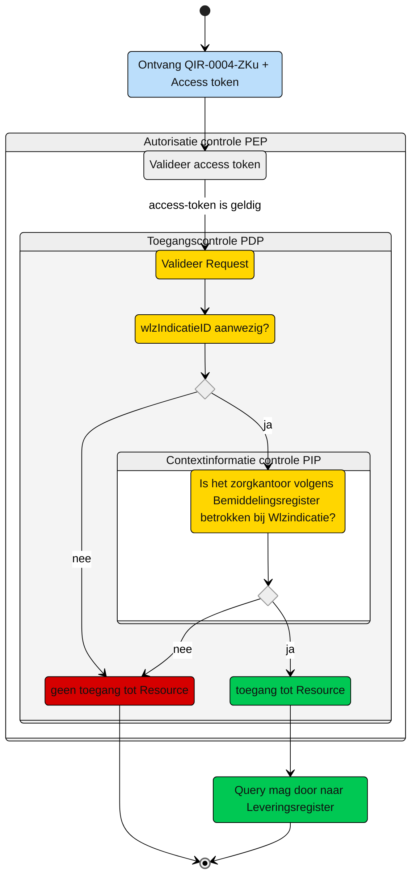

# Toegangscontrole: Raadplegen van de Leveringperiode door het zorgkantoor (UCLR-0006)  

> [!CAUTION]
> Beschrijving is nog niet juist
> 

Beschrijving van de **toegangscontrole** door de Policy Decision Point (PDP) en indien van toepassing Policy Information Point (PIP).

N.b. Het valideren van de Acces-token door de PEP is geen onderdeel van de ze beschrijving. Zie daarvoor het [Afsprakenstelsel iWlz - nID netwerkstelsel - 5. Policy Enforcement Point.](https://wlz.atlassian.net/wiki/spaces/IWLZAS/pages/229441537/nID+netwerkstelsel#5.-Policy-Enforcement-Point-(PEP))

## Toegangscontrole PDP
### Subject
- **Entiteit:** Zorgkantoor, verantwoordelijk of uitvoerend
- **Kenmerk:** In bezit van een access-token met daarin de eigen `uzovicode`


### **Action**
- **Type:** `raadplegen` (read)
- **Omschrijving:** Uitvoeren van GraphQL-query [`QLR-0006-ZK.graphql`](/gql-query/zorgkantoor/QLR-0006-ZK.graphql) op het Leveringsregister door een zorgkantoor


### **Resource**
- **Type:** `Wlz Leveringsregister`
- **ID:** `leveringperiodeID`
- **Beperking:** Alleen toegang tot gegevens van de Leveringsperiode (en overige informatie) waarvoor het zorgkantoor:
  1. Aan te merken is als het verantwoordelijke zorgkantoor voor de Bemiddelingspecificatie waaraan de Leveringsperiode via Levering is gekoppeld;
  2. Aan te merken is als een uitvoerend zorgkantoor, die betrokken is bij dezelfde Bemiddeling waaronder de Bemiddelingspecificatie waaraan de Leveringsperiode via Levering is gekoppeld. 
- **Inhoud:** Alle nodes, behalve `Verzoek` en `VerzoekAanbieder`, in het GraphQL-schema die horen bij deze `Leveringperiode` mogen direct worden opgevraagd


### **Context**
- **Query-parameters vereist:** De `leveringperiodeID` moet zijn meegegeven in de query
- **Toegangsvoorwaarde:**  Er is alleen toegang als aan alle volgende voorwaarden is voldaan:
  - De parameter `leveringperiodeID` is aanwezig in de query;
  - De **access-token** bevat een geldige `uzovicode` van het zorgkantoor;
  - In het **Bemiddelingsregister** bestaat er een `Bemiddelingspecificatie` waarbij:
    1.  De `uitvoerendZorgkantoor` overeenkomt met de `uzovicode` uit de access-token, **én**
    2.  Deze `Bemiddelingspecificatie` behoort tot een `Bemiddeling` waarvoor de `wlzIndicatieID` overeenkomt met de opgevraagde waarde.


### Resultaat

> Toegang tot het Leveringsregister via query [`QIR-0004-ZKu.graphql`](/gql-query/zorgkantoor/QIR-0004-ZKu.graphql) is **alleen toegestaan** als:
>
> - Parameter **`wlzIndicatieID`** is meegegeven in de query
> - De access-token bevat een geldige **`uzovicode`**
> - In het Bemiddelingsregister is een match gevonden tussen:
>   - De **`uzovicode`** (uit de access-token)
>   - En een **`Bemiddelingspecificatie`** die hoort bij een **`Bemiddeling`** met opgevraagde **`wlzIndicatieID`**
> 
> Indien aan deze voorwaarden is voldaan, mogen alle bijbehorende GraphQL-nodes worden opgevraagd conform de structuur van de query-template


# Toegangscontrole-flows Zorgkantoor uitvoerend: QIR-0004-ZKu.graphql

Beschrijving van het autorisatieproces door de PEP.

**schematisch:**



| # | Toelichting |
| --: | :-- |
| 1. |Ontvangst GraphQL-request + access-token door **PEP** |
| 2. |De **PEP** valideert de access-token en geeft na goedkeur het request door aan de PDP |
| 3. |De **PDP** controleert op:<ol><li>Of het request voldoet aan de template en er geen ongeoorloofde gegevens worden opgevraagd.<li> Aanwezigheid van de verplichte parameters in het request;</ol>Is aan alle voorwaarden voldaan?<br/> - **Ja** →  Controle context-informatie door **PIP**: stap 4<br/>- **Nee** → geen toegang tot de resource - *Einde proces (geen toegang.)* |  
| 4. | De **PIP** controleert in het `Bemiddelingsregister` op de aanwezigheid van een `Bemiddelingspecificatie` waarbij:<br/><ol><li>De `uitvoerendZorgkantoor` overeenkomt met de `uzovicode` uit de access-token, **én** <li>Deze `Bemiddelingspecificatie` behoort tot een `Bemiddeling` waarvoor de `wlzIndicatieID` overeenkomt met de opgevraagde waarde.</ol> Is aan de voorwaarde voldaan?<br/> - **Ja** →  Toegang tot de resource: stap 5<br/>- **Nee** → geen toegang tot de resource - *Einde proces (geen toegang.)*  |
| 5. | Het zorgkantoor krijgt toegang tot alle entiteiten die bij de Wlz-indicatie horen.
| 6. | *Einde*


**Controle query PIP:**
```gql
query Bemiddeling(
  $WlzIndicatieID: UUID! # afkomstig uit query
  $uzovicodeUitvoerendzorgkantoor: String! # afkomstig uit Access-token
) {
  bemiddeling(
    where: {
      and: [ {
         wlzIndicatieID: { eq: $WlzIndicatieID }
         verantwoordelijkZorgkantoor:  {
            neq: $uzovicodeUitvoerendzorgkantoor
         }
         bemiddelingspecificatie:  {
            all:  {
               uitvoerendZorgkantoor:  {
                  eq: $uzovicodeUitvoerendzorgkantoor
               }
            }
         }
      }]
    }
  ) {
      wlzIndicatieID
      bemiddelingspecificatie {
        uitvoerendZorgkantoor
      }
    }
}
```

---
Ga naar [UC beschrijving raadplegen](UCIR-0004-raadplegen.md) -- Terug naar [Raadplegen](/raadplegen/README.md)