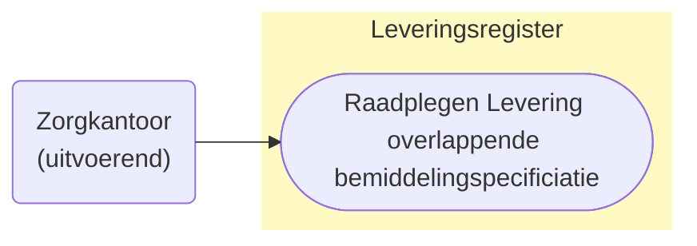

# Use cases raadplegen Levering van een informatieve bemiddelingspecificaties (UCLR-0009-ZK)

> [!CAUTION] 
> Voor de controle op de toegang van deze query is er een PIP controle nodig. De toets of dit mogelijk met de huidige informatie mogelijk is, is moet nog plaatsvinden. De query kan nog wijzigen, wat effect kan hebben op het schema. 

## Use Case Beschrijving

**Titel:** Raadplegen Levering van een informatieve bemiddelingspecificatie
**Actoren:** Zorgkantoor dat uitvoerend is voor een overlappende bemiddelingspecificatie

### Precondities:
* De levering is opgenomen in het Leveringsregister.
* Het zorgkantoor is uitvoerend zorgkantoor voor een bemiddelingspecificatie die overlapt met de bemiddelingspecificatie waar de levering bij hoort.

### Autorisatie:
Een zorgkantoor mag de Levering (en de overige gegevens) raadplegen.
* Volledige autorisatieregel: [LRA0004](https://informatiemodel.istandaarden.nl/informatiemodel/iwlz/netwerk/leveringsregister-1/regels/autorisatieregel/lra0004/)
* Autorisatiematrix: [LRA0004](/iWlz-levering/raadplegen/autorisatiematrix_leveringsregister.md)

### Trigger:
* Een zorgkantoor mag voor toeleiden de levering (en overige informatie) raadplegen die horen bij de (informatieve) toewijzingen van andere zorgkantoren. 

## Query-template beschrijving 
