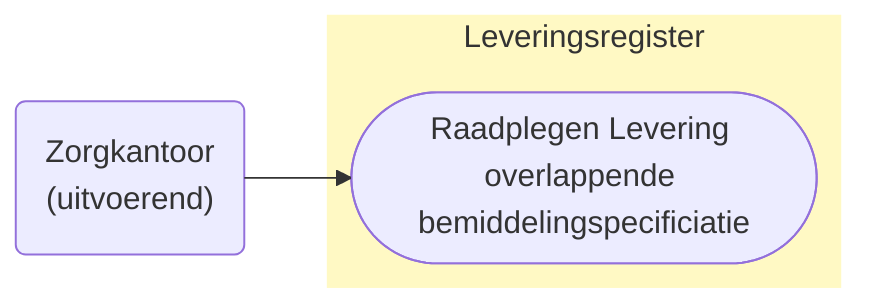
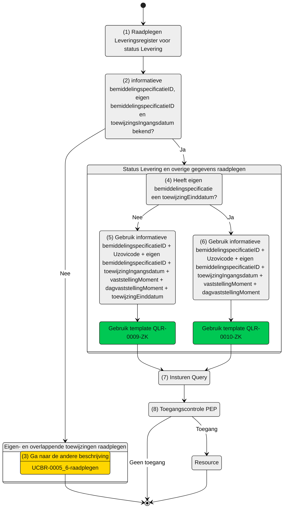

# Use cases raadplegen Levering van een informatieve bemiddelingspecificaties (UCLR-0009_10-ZK)

> [!CAUTION] 
> Voor de controle op de toegang van deze query is er een PIP controle nodig. De toets of dit mogelijk met de huidige informatie mogelijk is, is moet nog plaatsvinden. De query kan nog wijzigen, wat effect kan hebben op het schema. 

## Use Case Beschrijving

**Titel:** Raadplegen Levering van een informatieve bemiddelingspecificatie  
**Actoren:** Zorgkantoor dat uitvoerend is voor een overlappende bemiddelingspecificatie

### Precondities:
* De levering is opgenomen in het Leveringsregister.
* Het zorgkantoor is uitvoerend zorgkantoor voor een bemiddelingspecificatie die overlapt met de bemiddelingspecificatie waar de levering bij hoort.

### Autorisatie:
Een zorgkantoor mag de Levering (en de overige gegevens) raadplegen.
* Volledige autorisatieregel: [LRA0004](https://informatiemodel.istandaarden.nl/informatiemodel/iwlz/netwerk/leveringsregister-1/regels/autorisatieregel/lra0004/)
* Autorisatiematrix: [LRA0004](/iWlz-levering/raadplegen/autorisatiematrix_leveringsregister.md)

### Trigger:
* Een zorgkantoor mag voor toeleiden de levering (en overige informatie) raadplegen die horen bij de (informatieve) toewijzingen van andere zorgkantoren. 

## Query-template beschrijving 

|Query ID | Beschrijving | Verplichte input | Resultaat |
| :--- | :--- | :--- | :--- |
| QLR-0009-ZK | Op basis van de bemiddelingspecificatieID van de informatieve toewijzing, de eigen bemiddelingspecificatieID, eigen identificatie, toewijzingangsdatum, vaststellingMoment en toewijzingEinddatum de Levering (en overige toegestane informatie), raadplegen die hoort bij de informatieve toewijzing. | `bemiddelingspecificatieIDEigen`, `bemiddelingspecificatieIDInformatieve`, `uitvoerendZorgkantoor`, `toewijzingIngangsdatum`, `vaststellingMoment`, `dagVaststellingMoment`, `toewijzingEinddatum`, `bemiddelingID` | Levering / Client / Leveringperiode / Behandelingperiode / Uitstelperiode / Afstel | 
| QLR-0010-ZK | Op basis van de bemiddelingspecificatieID van de informatieve toewijzing, de eigen bemiddelingspecificatieID, eigen identificatie, toewijzingangsdatum en vaststellingMoment, de Levering (en overige toegestane informatie), raadplegen die hoort bij de informatieve toewijzing. | `bemiddelingspecificatieIDEigen`, `bemiddelingspecificatieIDInformatieve`, `uitvoerendZorgkantoor`, `toewijzingIngangsdatum`, `vaststellingMoment`, `dagVaststellingMoment`, `bemiddelingID` | Levering / Client / Leveringperiode / Behandelingperiode / Uitstelperiode / Afstel | 

## Proces raadplegen

Een zorgkantoor is (via een aanbieder) betrokken bij de zorg van een client. 
Met de aanvullende informatie uit de overlappende bemiddelingspecificatie (zie ook: [UCBR-0005_6-raadplegen](https://github.com/iStandaarden/iWlz-bemiddeling/blob/Bemiddelingsregister-1/raadplegen/zorgkantoor/UCBR-0005_6-raadplegen.md)) en de aanvullende informatie van de eigen bemiddelingspecificatie (zie ook: [UCBR-0004-raadplegen](https://github.com/iStandaarden/iWlz-bemiddeling/blob/Bemiddelingsregister-1/raadplegen/zorgkantoor/UCBR-0004-raadplegen.md)) kan dat zorgkantoor de status van de levering zien die horen bij de informatieve toewijzing. 
Hiervoor zijn naast de informatieve `bemiddelingspecificatieID` ook de eigen `bemiddelingspecificatieID`, de eigen `uzovicode` nodig. Tevens is van de eigen bemiddelingspecificatie ook de `toewijzingIngangsdatum`, het `vaststellingMoment`, en de `toewijzingEinddatum`zodra de eigen bemiddelingspecificatie een toewijzingEinddatum heeft nodig.
Deze aanvullende gegevens zijn nodig om vast te stellen dat er overlap is tussen de eigen- en informatie bemiddelingspecificatie.

> [!NOTE]  
> Zie [UCBR-0004-raadplegen](https://github.com/iStandaarden/iWlz-bemiddeling/blob/Bemiddelingsregister-1/raadplegen/zorgkantoor/UCBR-0004-raadplegen.md) voor het raadplegen van de `toewijzingIngangsdatum`, `vaststellingMoment` en de `toewijzingEinddatum`.
> Zie [UCBR-0005_6-raadplegen](https://github.com/iStandaarden/iWlz-bemiddeling/blob/Bemiddelingsregister-1/raadplegen/zorgkantoor/UCBR-0005_6-raadplegen.md) voor raadplegen van de informatieve `bemiddelingspecificatieID`.

### Schematisch 

| # | Toelichting |
| :--- | :--- | 
| 1. | Start raadplegen Leveringsregister | 
| 2. | Zijn de informatieve- en eigen `bemiddelingsspecificatieID` en toewijzingIngangsdatum bekend?  - **Ja** -> Ga verder naar stap 4.   - **Nee** -> Ga verder naar stap 3 |
| 3. | Gebruik eerst query-template `QBR-0005_6-ZK` (zie beschrijving [UCBR-0005_6-raadplegen](https://github.com/iStandaarden/iWlz-bemiddeling/blob/Bemiddelingsregister-1/raadplegen/zorgkantoor/UCBR-0005_6-raadplegen.md)) |
| 4. | Heeft de eigen `bemiddelingspecificatie` (inmiddels) een `toewijzingEinddatum`?  - **Ja** -> Ga verder naar stap 6   - **Nee** -> Ga verder naar stap 5. |
| 5. | Gebruik query-template `QLR-00009-ZK` en vul de verplichte parameters:   - `bemiddelingspecificatieIDEigen`;   - `bemiddelingspecificatieIDInformatieve`;   - `uitvoerendZorgkantoor`;   - `toewijzingIngangsdatum`;   - `vaststellingMoment`;  - `dagVaststellingMoment`;   - `toewijzingEinddatum` . |
| 6. | Gebruik query-template `QLR-0010-ZK` en vul de verplichte parameters:   - `bemiddelingspecificatieIDEigen`;   - `bemiddelingspecificatieIDInformatieve`;   - `uitvoerendZorgkantoor`;   - `toewijzingIngangsdatum`;   - `vaststellingMoment`;   - `dagVaststellingMoment`. |
| 7. | Het zorgkantoor stuurt GraphQL-request + Acces-token naar het Policy Enforcement Point (PEP). |
| 8. | De PEP voert de [toegangscontrole](@@@) uit en stuurt bij toegang het request door naar het Leveringsgregister. |
| 9. | Het zorgkantoor ontvangt response van de PEP (bij ongeldig verzoek) of vanuit het Leveringsregister (resource).
| 10. | *Einde proces* | 

 ---

Ga naar beschrijving van de bijbehorende [toegangscontrole](@@@)  |  Terug naar [Raadplegen](/raadplegen/README.md)
